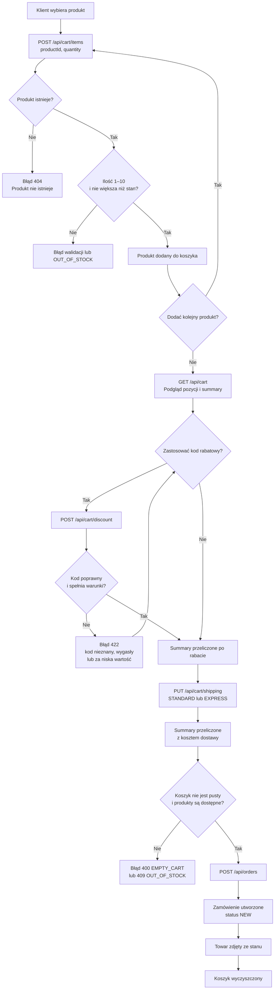

# Przepływ od dodania produktu do złożenia zamówienia

## Źródła

- `docs/architektura.md`: opis przepływu składania zamówienia.
- `docs/api.md`: endpointy koszyka, rabatu, dostawy i zamówień.
- `src/routes/cart.ts`: walidacja pozycji, rabatu i dostawy.
- `src/routes/orders.ts`, funkcja obsługi `POST /api/orders`: kontrola pustego koszyka i stanu magazynowego oraz utworzenie zamówienia.
- `docs/wymagania.md`: BR-03 (ilość i dostępność), BR-04 (dostawa), BR-05–BR-08 (rabaty i kwoty).

**MOŻLIWY BŁĄD (BR-03):** wymaganie mówi o ilości od 1 do 10 sztuk. W `src/routes/cart.ts`, w schemacie `updateItem`, ustawiono tylko limit maksymalny (`max(10)`), bez minimum `1`; diagram pokazuje zachowanie wymagane biznesowo.
